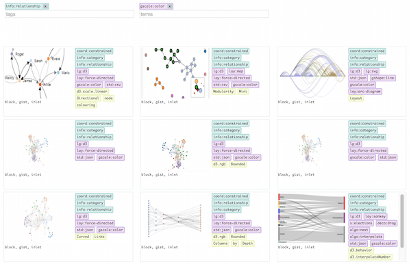

# d3js-bookmarks

To help browse/edit bookmarks in different area, I wrote an electron app, backed with a [nedb](https://github.com/louischatriot/nedb) format.

In this repo, I share any d3js related bookmark that points to some online resource (I have removed any bookmarks that points to my file system). Data have been converted to a `tsv` format, to reduce file size.

An explorer app is provided - [https://widged.github.io/d3js-bookmarks/index.html](https://widged.github.io/d3js-bookmarks/index.html)

For convenience, tags and terms can be specified in the queryString. Keys must be separated by ';'.

[https://widged.github.io/d3js-bookmarks/index.html?tags=coord:polar&terms=lay:chord;algo:bundle](https://widged.github.io/d3js-bookmarks/index.html?tags=coord:polar&terms=lay:chord;algo:bundle)

I gave a shot to coding with es6 without dependencies, without the need to transpile or hot reload during development. The only dependency is `babel-cli` to convert es6 code to es5 to support older browsers. Run `yarn run bundle` or `npm run bundle` to generate a es5 version of the code. (Note that the latest versions of Chrome and Safari can run the [es6 code](https://widged.github.io/d3js-bookmarks/app-dev.html) without any pre- or post-processing).

## TODO

* Limit tags and terms to the one still available for the items selected so far.
* Clicking on a tag or term in the item list should add that tag or term to the query options.
* Find the way to get `display:flex` to work in all browsers with thumbnails of varying sizes.
* use typescript
